<!--
FILE: docs/admin-mobile-p4c-production-runbook.md

WHAT THIS DOES (plain language):
  Defines the complete, evidence-driven path for moving Admin Mobile invoice and estimate parity
  from reviewed source into production. It separates repository work from Git publication,
  Cloudflare deployment, QuickBooks traffic control, shared-database migration, provider canaries,
  and rollback so no one step is mistaken for authorization to perform another.

DEPENDS ON:
  Internal: docs/admin-mobile-roadmap.md, docs/admin-mobile-dispatch.md,
            .claude/rules/initiative-status.md, docs/upr-unfinished-work-registry.md,
            BILLING-CONTEXT.md, UPR-QBO-SYNC-PROTOCOL.md, UPR-Web-Context.md,
            docs/architecture.md, docs/auth-and-authorization.md, docs/business-rules.md,
            docs/database-schema.md, docs/integrations.md, docs/testing-and-deployment.md
  Data:     reads  → Git refs, Cloudflare deployment/config metadata, Supabase catalog and ledgers,
                     QBO command/receipt state, Worker logs, smoke-test results
            writes → documentation only; every operational write described below is separately gated

NOTES / GOTCHAS:
  - This runbook is executable planning, not authorization to commit, push, deploy, change a live
    flag, apply a migration, call QuickBooks, move money, or delete production data.
  - Preview and Production Pages share one Supabase project. A migration is a production change.
  - UPR MCP is a separately deployed Cloudflare Worker even though it shares QBO credentials.
  - The current P4c candidate was built on a stale dev base. Never rebase, reset, stash, or switch
    the dirty shared worktree; reconstruct the release in a clean worktree from current main.
-->

# Admin Mobile P4c Production Runbook

**Created / last verified:** 2026-08-10
**Artifact tier:** Tier 3 — program release
**Initiative:** Admin Mobile Phase P4c
**Status:** maintenance/capability foundation authored and locally verified; clean reconstruction,
exact-candidate reviews and every live rollout authorization remain blocked/pending
**Owner:** Moroni Salvador

## 1. Outcome and authority

The production outcome is one native financial-document experience for invoices and estimates,
including New Invoice, New Estimate, and focused line create/update/delete/reorder, while preserving
their distinct accounting lifecycles and human Save-to-QuickBooks gate.

This runbook required two prerequisites that are now authored in the uncommitted source candidate:
a shared, fail-closed `qbo_provider_traffic_enabled` maintenance boundary across Cloudflare Pages
and UPR MCP, plus a default-off `feature:qbo_document_command_v2` capability gate around every P4c
control, route and Worker operation that depends on the six new migrations. Source and local tests
are not deployment: the traffic boundary must still be reconstructed, reviewed, deployed and proven
before the P4c migration window. The capability gate keeps Preview and a pre-migration Production
deployment from mounting or calling schema that is not live yet.

The same foundation deliberately contains five older write-surface families whose existing retry
contracts are not safe enough for this release: keyed-card charging, QBO attachment mutation and
QBO-linked payment deletion return stable source-level `503` refusals; UPR MCP remains QBO
read-only; and Stripe pay-link creation plus signed webhook projection refuse before any Stripe,
UPR-ledger or QBO mutation. The global traffic key cannot re-enable those surfaces. Restoring any
one requires a separate durable command/reconciliation design, tests, review and production
authorization after P4c.

Repository implementation is authorized by the owner's 2026-08-10 request. The following remain
separate owner decisions every time they occur:

| Gate | Action requiring current owner authorization |
|---|---|
| `AUTH-GIT` | commit, push, remote dev synchronization, branch publication, PR creation or merge |
| `AUTH-CONFIG` | insert/update `integration_config`, change a Cloudflare variable, or flip any feature flag |
| `AUTH-DEPLOY-PAGES` | deploy or redeploy Preview or Production Pages |
| `AUTH-DEPLOY-MCP` | deploy or disable the separately operated UPR MCP Worker |
| `AUTH-DB` | apply a migration or rollback to the shared Supabase project |
| `AUTH-PROVIDER` | call QuickBooks/Intuit, exchange or refresh a live token as a test, or create/update/delete provider data |
| `AUTH-MONEY` | create, receive, void, reverse, or otherwise move/record money in a provider or production ledger |
| `AUTH-CLEANUP` | delete live/provider test records created by an authorized canary |

An approval for one row is not approval for another row or for a later repetition of the same row.

## 2. Evidence ledger

Evidence below was captured read-only on 2026-08-10. Re-run every volatile fact against the exact
release candidate before using it as a go/no-go decision.

| Capability | Verdict | Evidence | Consequence / next proof |
|---|---|---|---|
| Shared invoice/estimate document UI and native create routes | HAVE — source | P4c roadmap checks, focused UI tests, signed-in iOS 27 Simulator walkthrough | Re-prove after reconstruction on current main; physical-device feel remains owner-gated |
| Provider-first invoice line operations | HAVE — source/local DB | Authored `20260810182847`; Worker/static/local qualifier evidence | Migration is unapplied; exact committed bytes and live postflight still required |
| Durable estimate command/reservation boundary | HAVE — source/local DB | Authored `20260810182855`; exact request binding, cents, replay, rollback and race proofs | Migration is unapplied; exact committed bytes and live postflight still required |
| Durable single-company QBO binding and refresh CAS | HAVE — source/local DB | Authored `20260810182905`; Pages and MCP source tests; local forward/race/rollback/reapply proof | Source is not deployment. Both runtimes must be compatible before apply |
| P3 invoice/payment lock prerequisites | HAVE — source/local DB | Authored `20260810010000`, `20260810020000`, `20260810030000` and local proofs | All three are unapplied and precede P4c migrations |
| Global provider traffic pause | HAVE — source/local tests | Exact-text, bounded fail-closed Pages + MCP guard; central provider/credential checks; route, webhook, scheduler and close-race tests | Reconstruct on current main, pass blocking reviews, deploy both runtimes and prove live refusal before the migration window |
| Unsafe legacy money/QBO-write containment | HAVE — source/local tests | Keyed-card, attachment mutation and QBO-linked payment delete return stable durable-boundary-required `503`; linked-payment and attachment UI are read-only; MCP mutations refuse before credentials/provider; Stripe pay-link and signed webhook refuse before local/provider work | Product-impacting source-only behavior. Re-prove after reconstruction and disclose before deploy; global traffic reopen must not re-enable it |
| P4c schema-dependent capability admission | HAVE — source/local tests | Strict no-preview predicate; web/native line routes and controls; invoice line variants plus all estimate mutations denied before command/schema work | Reconstruct and deploy with row missing/OFF; seed only under separate config approval and enable only after migration postflight |
| QBO command drain | HAVE at capture / volatile | Read-only capture showed 46 succeeded invoice commands and zero nonterminal; payment receipt attempts were empty | Re-query at the maintenance high-watermark; any unresolved outcome is a hard stop |
| Live migration state | HAVE at capture / volatile | None of the six target migration versions appeared in the shared ledger | Re-query exact versions and catalog immediately before apply |
| Live rollout flags | HAVE at capture / volatile | `feature:billing`, `feature:qbo_receive_payment`, and `page:admin_mobile` were enabled/not force-disabled | Flags are not authorization or maintenance controls; re-read before UI/provider canary |
| QBO environment/binding | PARTIAL | One production QBO credential row exists; new durable binding table is absent because `182905` is unapplied | Compare value-free realm/environment/generation relationships during preflight; never disclose tokens |
| Git release topology | PARTIAL / unsafe | After `git fetch origin`: `origin/dev=cc4a02b`, `origin/main=1a3d8d1`, and main contains dev plus 26 commits | Fast-forward dev to exact main before landing any new release; never rewrite either branch |
| Current candidate provenance | PARTIAL / unsafe | Detached `e9090cba`, based on stale dev; six content commits plus two stale-base merge commits; 94 dirty paths | Reconstruct in a clean current-main worktree; cherry-pick content commits only; inventory uncommitted changes |
| Preview/Production/MCP deployed SHA and bindings | UNKNOWN | Repository declarations do not prove Cloudflare state | Read back deployment IDs, commit SHAs, bindings, routes and MCP version before each live phase |
| Production provider behavior | UNKNOWN | No P4c provider call has been made | Only a separately approved allowlisted, sub-$10 canary may close this gate |

The Supabase April 2026 Data API change makes explicit grants necessary for newly exposed public
objects. The P4c ledgers intentionally remain service-only and the migration reviews must continue
to prove explicit revokes/grants rather than relying on project defaults.

## 3. Decisions and rejected options

### Selected design

Ship in two code releases:

1. **QBO maintenance and containment foundation** on current production code. It introduces no
   schema. Exact `true` preserves the enumerated supported provider paths, while five unsafe legacy
   write surfaces remain deliberately source-disabled as described below.
2. **P4c application release** reconstructed on top of that deployed foundation. The gate is then
   closed after a zero-active-work preflight, P4c Production deployed with its capability flag still
   off, the six migrations applied serially, the capability enabled, and provider traffic reopened
   once as an explicitly observed boundary.

This extra release is deliberate. It proves the emergency brake before the release that needs it
and removes the race where a rolling deployment could still run old provider-capable code.

### Rejected options

| Option | Why rejected |
|---|---|
| Merge the current dirty detached worktree | It is based on dev that is 26 commits behind production and mixes committed and uncommitted inputs |
| Force-push/rebase dev or main | Rewrites shared history and can erase already released work |
| Use `page:admin_mobile` or `feature:billing` as maintenance | UI routing does not stop direct Workers, webhooks, token refresh, Stripe bookkeeping, or MCP |
| Use only `upr_mcp_enabled` | It controls only MCP and historically fails open when its config lookup fails |
| Apply migrations before compatible code | `20260810182905` rejects legacy credential writers; new document workers also depend on new RPCs |
| Put all P4c migrations in one apply call | It hides which boundary failed, overlaps hot-table locks, and prevents narrow postflight/rollback decisions |
| Keep reads open during maintenance | QBO reads can refresh credentials; a write-only pause does not quiesce credential state |
| Automatically expire reservations | Unknown provider outcomes must remain fenced until exact retry or reconciliation |
| Treat rollback as returning to the old world | The estimate and binding rollbacks intentionally retain security/audit evidence |

## 4. Frozen maintenance-gate contract

### Configuration

- Key: `integration_config.key = 'qbo_provider_traffic_enabled'`.
- Only the exact text value `'true'` permits QBO traffic.
- Missing row, NULL, whitespace/case variants, any other value, lookup timeout, malformed response,
  or database error denies traffic.
- The key is server-owned and never accepted from a browser request or exposed with credential data.
- Do not cache an allow decision across requests. Every external request and credential write
  obtains a fresh decision close to the side effect.

The separate P4c schema capability is `feature:qbo_document_command_v2` in `feature_flags`:

- only `enabled === true && force_disabled !== true` is ON;
- missing, disabled or force-disabled is OFF, `dev_only_user_id` is seeded NULL, and this capability
  never honors the ordinary owner/dev-only preview exception;
- add it to the UI missing-row fail-closed set and implement one explicit capability predicate for
  affected UI controls/routes and Workers rather than calling the preview-aware generic resolver;
- it gates invoice line create/update/delete/reorder routes and controls, invoice Worker
  `line_update`/`line_change` payloads, estimate line routes/controls, and every candidate
  `/api/qbo-estimate` mutation before schema-dependent command lookup/reservation;
- it does not gate legacy invoice save/send/delete requests without a line operation, nor existing
  invoice/create-estimate creation RPCs that do not consume the six migrations. Those remain the
  migration-abort fallback under their existing billing and provider gates;
- old Production source ignores the disabled row, so it can be seeded safely before Preview P4c;
- it remains OFF through Preview, Production deployment and all six migrations, and turns ON only
  after exact postflight succeeds;
- it never substitutes for billing role authorization or the provider traffic gate.

### Pages enforcement

Central enforcement occurs immediately before:

- every Accounting API request (`qboFetch`);
- the multipart `uploadAttachable` request, which bypasses `qboFetch`, both before any refresh and
  immediately before its raw Intuit upload fetch;
- every Payments API request (`paymentsFetch`);
- OAuth token exchange/refresh (`postToken`);
- credential persistence, connection replacement and generation-CAS refresh.

Entry guards also run before command/receipt reservation or local provider-derived mutation in the
provider-capable paths that remain supported:

- QBO invoice, estimate, receive-payment and legacy payment routes;
- customer sync, QBO connect/callback, generic query/drift/sync routes;
- the QBO-backed Collections assistant (`collections-chat`) and any other provider read that may
  refresh credentials;
- QBO webhook, CDC/scheduler and reconciliation workers.

For ordinary provider-capable API paths, the closed response is retryable `503` with stable machine
reason `qbo_provider_traffic_disabled`; it never contains config values or credential details.
Durable invoice/estimate/receipt work interrupted by a later fresh check keeps its exact operation
identity/fence while surfacing that reason. An AI turn already started and the authenticated QBO
webhook are explicit non-503 cases because asking the originator to replay would be unsafe or
ineffective.

### Source-level legacy containment

These boundaries are unconditional and remain in force even when provider traffic is exact `true`:

- `POST /api/qbo-charge` authenticates and cheaply validates the request, then returns `503` with
  `code` and `reason` `qbo_charge_durable_boundary_required`; it performs no invoice/contact read,
  local payment insert, token refresh, card capture or QBO Payment creation.
- `POST /api/qbo-attach` upload and delete authenticate and cheaply validate, then return `503` with
  `code` and `reason` `qbo_attachment_durable_boundary_required`; no pending sentinel, multipart
  upload or provider delete occurs. Read-only attachment metadata/listing paths remain available,
  and the attachment panel exposes no upload/delete control.
- `POST /api/qbo-payment` with `action='delete'` authenticates and cheaply validates, then returns
  `503` with `code` and `reason` `qbo_payment_delete_durable_boundary_required` before maintenance
  config, business-row or provider access. QBO-linked payments are locally read-only and must be
  corrected in QuickBooks; the existing create/mirror path remains a supported, separately guarded
  operation.
- UPR MCP QBO create/update/delete/send primitives and inspection-backed mutation tools return
  `503` with `code` and `reason` `qbo_mcp_mutation_durable_boundary_required` before config,
  credentials, refresh, CAS or provider access. Read/query/report tools remain available behind the
  maintenance gate.
- `POST /api/stripe-pay-link` authenticates and cheaply validates, then returns `503` with `code`
  and `reason` `stripe_projection_durable_boundary_required` before invoice/config/provider work.
  The signed Stripe webhook verifies the configured signature, then returns the same retryable
  `503` before Supabase, event claim, local payment/refund/dispute/payout projection, notification,
  Worker telemetry or any provider call. Invalid signatures remain `400`. No flag can reopen these
  paths; a future durable Stripe ingestion/projection boundary is a separate initiative.

### Webhook and scheduler behavior

- Stripe follows the source-level containment above regardless of the global QBO traffic value.
  The pay-link route refuses after authorization and cheap validation. The webhook refuses only
  after signature verification, but before claim or any local/provider effect, so Stripe may retry
  the delivery without colliding with UPR's one-shot event claim.
- QBO webhooks authenticate, claim/persist immutable event evidence, mark it durable `retry` with a
  maintenance reason and next retry, make no QBO fetch, and return `200`. Intuit receives its required
  acknowledgement while UPR retains work for the post-maintenance scheduler; a closed-gate `503`
  must never train Intuit to disable the webhook.
- Schedulers/pollers record a skipped/retryable maintenance outcome and leave durable work eligible
  after reopening.

Keyed-card charging never reaches Intuit in this release; its dedicated source-level refusal is not
the maintenance response and is not retryable by toggling the maintenance key. Collections keeps an
already-started AI turn on its normal response path with a sanitized maintenance tool result.
Xactimate import may finish its local, non-idempotent work while marking optional QBO class mapping
unavailable; neither path is blindly replayed.

### UPR MCP enforcement

UPR MCP performs the same exact-value, fail-closed check before supported read operations and before:

- token refresh;
- generation-CAS credential persistence;
- every QBO read.

Mutation primitives and mutation tools are additionally source-disabled by the unconditional
durable-boundary-required refusal above. Neither exact `true` nor `upr_mcp_enabled=true` overrides it.

`upr_mcp_enabled=false` remains a defense-in-depth option for the window, not a substitute for the
provider gate. A failure to read either maintenance decision must not allow QBO access.

### Negative proof

Tests must show missing, false, malformed, timeout and lookup-error decisions cause zero upstream
fetch, zero token persistence, zero command/receipt reservation and zero local provider projection.
Dedicated containment tests must prove card charge, attachment mutation and QBO-linked payment
delete cannot reach local or provider effects, linked-payment/attachment UI cannot issue those
mutations, MCP mutation tools cannot perform even preliminary provider reads, and Stripe pay-link
plus signed webhook return their exact refusal before all local/provider work. QBO webhook proof
must assert durable retry plus `200`. Exact `'true'` preserves only the supported provider-capable paths.
Cross-runtime source contracts pin Pages and MCP maintenance responses to the same key/reason
vocabulary while retaining the distinct durable-boundary-required refusal reasons.

## 5. Dependency graph

```mermaid
flowchart TD
  A["Freeze Tier 3 runbook"] --> B["Build QBO maintenance foundation on current main"]
  B --> C["Full tests + worker security review"]
  C --> D{"AUTH-GIT + AUTH-CONFIG + deployments"}
  D --> E["Fast-forward dev to main; seed traffic=true; deploy Pages + MCP foundation"]
  E --> F["Prove gate open/closed behavior and restore true"]
  F --> G["Reconstruct P4c on the gate foundation"]
  G --> H["Full repository/native/DB/reviewer close-out"]
  H --> I{"AUTH-GIT: publish to dev and promote to main"}
  I --> J["P4c capability remains OFF; Preview gate smoke; prepare maintenance window"]
  J --> K{"Prove zero active work; AUTH-CONFIG: close provider gate; drain in-flight"}
  K --> L["Deploy exact P4c Production Pages + MCP bytes"]
  L --> M{"AUTH-DB: apply six migrations serially"}
  M --> N["Catalog, ACL, RLS, ledger and binding postflight; enable P4c capability"]
  N --> O{"AUTH-CONFIG / AUTH-PROVIDER"}
  O --> P["Single controlled reopen + allowlisted canary + smoke"]
  P --> Q["Production verified; preserve evidence and retire release row"]
```



No node after a diamond inherits authorization from an earlier diamond.

## 6. Phase plan

### Phase R0 — Freeze evidence and ownership

**Objective:** make the release reproducible without conversation history.

**Repository work**

- Adopt this runbook from the P4c roadmap, live initiative status and unfinished-work registry.
- Record the dirty candidate's exact HEAD, remote refs, content commits, changed/untracked inventory,
  and all six migration/rollback/proof files.
- Freeze the gate vocabulary, caller inventory, migration order and stop conditions.

**Pass evidence**

- Every referenced path exists.
- `git diff --check` passes for planning files.
- An independent challenge reviews evidence, ordering, authorization, failure recovery and simpler
  alternatives.

**No live action.**

### Phase F — QBO maintenance and legacy-write containment foundation

**Objective:** add a single fail-closed provider brake without schema, preserve enabled behavior for
the supported P4c/legacy invoice paths, and source-disable older QBO write paths whose retry model
cannot meet the release's durable side-effect contract.

**Owned seams**

| Lane | Files / responsibility | Forbidden overlap |
|---|---|---|
| Pages core | new shared gate helper; `functions/lib/quickbooks.js`, including multipart attachment; central transport/token tests | no migration or UI edits |
| Pages callers | QBO/Stripe/webhook/scheduler entry guards and route-specific retry semantics | do not duplicate transport or auth helpers |
| UPR MCP | `upr-mcp/src/qbo.js`, tool-layer mutation preflight, its Supabase helper only if required, MCP tests | no Pages or migration edits |
| Legacy write containment | keyed-card charge, QBO attachment mutation, QBO-linked payment delete, Stripe pay-link/webhook refusal and focused tests | do not add a flag escape or unsafe replay |
| Integration | cross-runtime QA source contract, canonical docs, full suite and reviewers | no provider/live config action |

Parallel lanes start only after the exact helper contract above is frozen. Integration owns conflict
resolution; no lane reverts another lane's edits.

**Required tests**

- central Pages Accounting, Payments, OAuth and credential writers: enabled + five deny cases;
- every supported mutation route denies before durable reservation/local write when maintenance is closed;
- keyed-card/attachment/QBO-payment-delete/MCP mutation refusals are unconditional and provider/local-effect-free;
- Stripe pay-link refuses after auth/cheap validation and the signed webhook refuses after signature
  verification; both return the exact retryable `503` before DB claim, local money or provider work;
- QBO webhook/scheduler retains retryability without provider access;
- MCP reads and refresh CAS fail closed; MCP writes remain source-disabled;
- P4c `feature:qbo_document_command_v2` is fail-closed, ignores dev-only preview, and rejects the
  enumerated UI/Worker operations before schema-dependent reads or command work while preserving
  legacy invoice save/send/delete;
- outbound calls remain timeout-bounded;
- authorization/idempotency/cents and supported response contracts do not regress; intentional
  containment responses are pinned as product-impacting release behavior.

**Close-out**

- focused Worker/MCP/QA tests;
- full `npm test`, `npm run build`, changed-file ESLint and strict bundle check;
- `worker-security-reviewer`, `upr-pattern-checker`, and money-path review;
- canonical QBO/integration/deployment/Web Context docs updated as source-only.

### Phase G — Clean current-production reconstruction

**Objective:** produce one reviewable P4c candidate whose first parent is current production plus the
deployed maintenance foundation.

**Procedure**

1. Fetch origin and re-prove the dev/main ancestry and exact SHAs.
2. Leave the current dirty detached worktree untouched.
3. In a clean worktree rooted at current `origin/main`, integrate the maintenance foundation.
4. After the separately authorized remote dev fast-forward, verify `origin/dev == origin/main`.
5. Cherry-pick only the six P4c content commits in order:
   `a22aed01`, `85496656`, `2b05af71`, `9697d44f`, `f3126b4c`, `b139ade0`.
6. Do not cherry-pick `82c65ea6` or `e9090cba`; they only merge the stale dev base.
7. Generate a manifest of the 94 dirty paths relative to `e9090cba`. Classify each as P4c-owned,
   already represented by current main/foundation, unrelated, or conflict requiring re-review.
8. Transplant only P4c-owned edits in bounded logical groups. Preserve the original dirty worktree
   until the reconstructed candidate is byte-accounted and verified.
9. Re-audit every conflict against the 26 production commits that the old candidate lacked.

**Hard stops**

- the selected main/dev/foundation base advances after the final release-base pin. Before that pin,
  restart or replay the reconstruction on the newly fetched base rather than pretending origin can
  remain frozen for a multi-day build;
- a candidate change cannot be attributed to a content commit or inventory item;
- any migration file differs from its last qualified bytes without rerunning its qualifier/reviews;
- current main has changed an auth, payment, credential or QBO contract that the candidate assumes.

### Phase V — Exact-candidate verification

**Objective:** prove the reconstructed candidate, not the stale worktree or an earlier hash.

**Repository layers**

```text
npm run build
npm test
npm run build:ios
node scripts/assert-native-dist.mjs
node scripts/native-bundle-boundary.node-test.mjs
npm run check:tooling-generated
npm run validate:tooling
npm run test:tooling
node scripts/check-migration-hygiene.mjs
node scripts/bundle-size-report.mjs --strict
npx eslint <exact changed JS/JSX files>
git diff --check
```

Run all four current local DB qualifiers on the exact candidate and preserve their input hashes and
cleanup receipts:

```text
npm run test:db:invoice-line-edit-lock:local
npm run test:db:qbo-invoice-command-reservation:local
npm run test:db:qbo-payment-allocation-lock-fence:local
npm run test:db:qbo-estimate-command-boundary:local
```

The invoice reservation qualifier carries the `182847` document proof and the estimate qualifier
carries the `182905` binding proof. Re-run migration-safety, anon-grant, worker-security, design, accessibility,
page-lifecycle, native-route and Admin Mobile phase review. Repeat signed-in iOS Simulator checks at
390px, background/resume for 30 seconds, route precedence, disabled flags, locked documents, create,
line actions and both matching details without calling QBO.

**Candidate acceptance**

- clean worktree and named branch;
- zero P0/P1/P2 from required blocking reviewers;
- every six forward/rollback pair exact and locally qualified;
- no migration or live/provider action claimed;
- current dev/main relationship and intended promotion path documented.

### Phase D1 — Publish and prove the maintenance foundation

This phase requires `AUTH-GIT`, `AUTH-CONFIG`, `AUTH-DEPLOY-PAGES`, and `AUTH-DEPLOY-MCP` at their
respective steps.

1. Fast-forward remote dev to the exact current main SHA; never force-push.
2. Run the normal dev/Preview smoke so dev is proven equal to already-live Production before adding
   foundation code.
3. Before any gate-enabled deployment, owner-authorized config writes
   `qbo_provider_traffic_enabled='true'`; old code ignores it. Read back the exact key only.
4. Publish the reviewed foundation to dev and verify the Preview deployment SHA and root/assets
   smoke. An exact-true database read plus the deployed source/tests is the open-state proof; do not
   call a QBO read merely to prove open because it may refresh a live token.
5. Promote the exact foundation through a reviewed dev-to-main PR. Repository docs declare a
   main-branch Workers Builds configuration for UPR MCP, but live deployment bindings are UNKNOWN:
   verify whether the merge starts both Production Pages and UPR MCP, then wait for both exact
   immutable versions. If it does not deploy MCP, use a separately owner-authorized Production
   deployment or keep MCP disabled. An ad-hoc `wrangler deploy` is never a Preview substitute.
6. In a short approved proof window, set the gate false, verify a safe authenticated QBO route and
   MCP tool refuse before provider fetch, verify zero new command/receipt/provider projection, then
   restore exact true. No open-path provider call or real provider mutation is needed.

Failure to prove either runtime means P4c remains blocked.

### Phase D2 — Publish P4c application source

This phase requires new `AUTH-GIT` and deployment approvals; D1 approval does not carry over.

1. Under separate config authorization, seed `feature:qbo_document_command_v2` disabled/not
   force-disabled with `dev_only_user_id = NULL`. Old Production ignores it; new P4c source fails
   closed without the ordinary owner-preview exception.
2. Publish the exact reconstructed candidate to synchronized dev.
3. Verify CI, Preview deployment SHA, immutable asset smoke, native graph and the explicit
   capability-off UI/Worker response. Schema-dependent routes/actions must not mount or reserve;
   Preview validation is read-only and gate-only until migration postflight.
4. Pin the final dev SHA and open the reviewed dev-to-main PR.
5. Confirm strict provenance, required checks and diff ownership on that exact SHA.
6. Merge the reviewed PR only at the start of an already approved low-traffic maintenance window.
   Main auto-deploys; there is no separately schedulable Pages release in this repository.

### Phase M — Maintenance, Production deployment and migration apply

This phase requires current `AUTH-CONFIG`, `AUTH-DEPLOY-PAGES`, `AUTH-DEPLOY-MCP`, and `AUTH-DB`.

#### Enter maintenance

1. Record the exact Preview, Production, MCP and candidate SHAs plus a high-watermark timestamp.
2. While traffic is still open, query every active invoice/estimate command, reservation, payment
   receipt attempt, allocation fence and provider event. Also inventory every `qbo_attachments`
   sentinel whose `qbo_attachable_id` starts with `pending:`, recent `payments.qbo_sync_error`
   residue (including Stripe charge IDs and `Card charge #...` references), nonterminal
   `stripe_events` plus any processed row whose `error` is non-NULL, contact customer-sync failures,
   and recent `worker_runs` for `qbo-charge`,
   `stripe-webhook`, `qbo-webhook` and `qbo-payments-sync`. If any `prepared`,
   `provider_started`, `ambiguous`, `provider_succeeded`, `needs_reconciliation`, `submitting`,
   `qbo_created`, or `unknown_outcome` needs provider reconciliation—or any of those non-ledger
   residues is unexplained—abort the window and resolve it under normal guarded operation. Do not
   close the all-QBO gate and then expect provider-backed reconciliation.
3. Begin only from zero active/unexplained work. Set `qbo_provider_traffic_enabled` to anything
   other than exact `true` (canonical value: `false`) and prove a guarded Pages route plus MCP tool
   refuse against the already deployed foundation before the main merge.
4. Optionally set `upr_mcp_enabled=false` as defense in depth; read back actual MCP refusal.
5. Wait at least 90 seconds: the longest known direct Intuit transport is the 30-second multipart
   attachment timeout, ordinary provider/token calls are 15 seconds, and the remainder is margin for
   local finalization. Then take two quiet observations at least 30 seconds apart showing no new
   relevant Worker starts, command/reservation/attempt transitions, provider events, pending
   attachment sentinels, Stripe-event transitions or QBO sync-error residue after the recorded
   high-watermark.
6. Re-query the complete ledger and non-ledger inventory from step 2 and require zero active or
   unexplained residue. Historical captured-card/QBO-mirror or already-claimed Stripe-event residue
   from bytes predating this containment is evidence to reconcile—not a request to replay the source
   money action. Any state created in the close race is a hard stop: keep migrations unapplied,
   restore traffic only under a new config decision, resolve the outcome through its idempotent
   recovery seam or explicit operator reconciliation, and restart the window from step 1.
7. Prove supported new browser/provider work refuses before reservation/local/provider side effects;
   prove charge, attachment mutation, QBO-linked payment delete and MCP mutation remain
   unconditionally refused; prove Stripe pay-link and a correctly signed Stripe webhook return the
   exact refusal with zero DB/local/provider work; and prove QBO webhook maintenance delivery is
   durably queued/retryable and acknowledged without QBO fetch.

#### Deploy application bytes

1. Merge only the reviewed dev-to-main PR after the closed-foundation proof above.
2. The merge starts Production Pages and, only if the declared live Workers Builds binding is
   verified, UPR MCP asynchronously. Otherwise perform the separately authorized MCP deployment or
   keep it disabled. Wait for both intended exact deployments and smoke the immutable Pages
   deployment plus production alias while both gates remain closed/off.
3. Verify MCP is the expected gate/CAS implementation or keep MCP disabled.
4. Stop if any old Pages/MCP instance can still write QBO credentials directly.

#### Apply migrations

Apply one committed, reviewed file per governed Supabase migration operation, in this exact order:

1. `20260810010000_invoice_line_edit_lock_boundary`
2. `20260810020000_qbo_invoice_command_reservation`
3. `20260810030000_qbo_payment_allocation_lock_fence`
4. `20260810182847_invoice_document_line_operations`
5. `20260810182855_estimate_qbo_command_boundary`
6. `20260810182905_qbo_single_company_binding`

Serialize them in a low-traffic window. Use a bounded lock timeout and abort rather than wait behind
hot writes. Never paste edited SQL or batch the files.

After each apply, read back:

- migration ledger version/name;
- exact function signatures and material body invariants;
- trigger names and enabled state;
- table RLS and FORCE RLS posture;
- policy roles and predicates;
- table/function ACLs, including zero PUBLIC/anon/authenticated access to service-only ledgers/RPCs;
- expected old-client signature compatibility;
- PostgREST schema visibility/reload where the new Worker consumes an RPC.

Before creating any `IF NOT EXISTS` target, catalog-preflight that
`qbo_estimate_commands`, `qbo_estimate_command_reservations`, and `qbo_company_binding` are absent
or exactly match the reviewed shape. An unexpected pre-existing object is a stop, not permission to
adopt it. Do not include realm or credential values in the release record.

For `182905`, additionally require one durable binding when credentials exist, matching
environment/realm/generation between binding and credential, a present guard trigger, and
service-only replace/refresh RPCs. The following errors are hard stops and must never be bypassed:

- `QBO_COMPANY_BINDING_MISMATCH`
- `QBO_COMPANY_BINDING_ARTIFACT_REALM_MISMATCH:<table>`
- `QBO_COMPANY_BINDING_UNATTRIBUTED_REALM_EVIDENCE`

### Phase C — Controlled reopen and production proof

This phase requires fresh `AUTH-CONFIG`; any provider canary also requires `AUTH-PROVIDER`, and a
payment canary requires `AUTH-MONEY` plus cleanup authority.

1. Keep the global gate closed while running catalog, authorization and non-provider UI smoke on
   both production web and native routes.
2. Verify missing/disabled role/feature paths, locked invoice/estimate paths, stale-route guards,
   create route precedence and maintenance feedback.
3. Enable `feature:qbo_document_command_v2` only after all six postflights pass; verify both UI and
   document Workers now admit the schema-dependent surface while QBO traffic remains closed.
4. Re-enable MCP's own switch only if the exact deployed MCP SHA is proven and intended for use.
5. Set `qbo_provider_traffic_enabled='true'` and read back both runtimes. This is one all-at-once
   provider boundary for the supported Pages QBO/webhook/scheduler reads and mutations. Do not
   describe it as class-by-class technical containment. It does not enable keyed-card charging,
   attachment mutation, QBO-linked payment deletion, MCP mutation, Stripe pay-link creation or
   Stripe webhook projection.
6. Observe by class—read/query, customer sync, estimate, invoice, receive-payment—without claiming
   separate gates. Keep independently controllable schedulers and MCP disabled until their own
   read-only checks are complete, then authorize MCP reads separately if desired. Monitor Worker
   logs, durable commands, reservations, receipt attempts, provider identities, pre-existing pending
   attachment sentinels, historical Stripe projection residue and payment/contact QBO sync errors
   after each observation.
7. If authorized, use only a `BILLING-CONTEXT.md` §0 allowlisted QBO CustomerRef for the agent-run
   invoice/payment canary, keep every amount below $10, preserve the exact human action, and delete
   every created UPR/QBO test record before the session ends. Never match by display name.
8. A human-owned estimate/send check remains separate because the test-customer exception does not
   silently authorize estimate provider writes.
9. Run Production alias smoke, authenticated PWA smoke, installed native resume/account-switch
   checks, and verify no unexpected QBO/Webhook backlog. Verify every source-level containment
   response and read-only UI state remains exact; do not attempt a charge, attachment, linked-payment
   delete, Stripe pay-link or Stripe webhook provider mutation as a smoke test.
10. Record exact SHAs, migration ledger entries, config states, canary identities (non-PII), cleanup,
   reviewer verdicts and residual risks. Only then mark P4c live and retire the registry row.

## 7. Stop conditions

Stop without improvising when any of these occurs:

- remote dev/main ancestry or candidate SHA changes after approval;
- dirty/unattributed source appears in the clean release worktree;
- foundation gate is missing, fail-open, cached stale, or absent from either runtime;
- P4c capability is enabled before all six postflights, honors a dev-only preview assignment, or is
  missing from an enumerated schema-dependent UI/Worker operation;
- deployed SHA/binding cannot be proven;
- any unresolved provider outcome or in-flight credential refresh remains at the window;
- any pending attachment sentinel, nonterminal or error-bearing Stripe event, card-charge QBO mirror residue,
  customer-sync residue or maintenance-tagged Worker run is unexplained at the window;
- migration ledger/catalog differs from expected predecessors;
- migration source/rollback/proof hash differs from the reviewed candidate;
- lock timeout, DDL contention, ACL/RLS mismatch or PostgREST schema failure;
- a binding preflight error listed above;
- provider response/customer/document identity disagrees with the frozen realm or command;
- canary cannot be confined to the named test CustomerRef and cleanup contract;
- any source-disabled charge/attachment/QBO-payment-delete/MCP mutation or Stripe pay-link/webhook
  effect becomes reachable through configuration, alternate route or stale deployment;
- any reviewer raises an unresolved P0/P1/P2 on the exact candidate.

Closing the gate and preserving evidence is success under a stop condition. Continuing with an
unproven assumption is not.

## 8. Rollback and forward-repair policy

### Code/config incident

1. Close `qbo_provider_traffic_enabled` and, if relevant, `upr_mcp_enabled`.
2. Verify both runtimes refuse traffic and drain in-flight work.
3. Inventory ambiguous provider outcomes without attempting a provider read while the global gate is
   closed. A closed gate cannot perform provider-backed reconciliation.
4. If reconciliation is required, stop the rollback. Build, review and deploy an inert,
   CAS-compatible recovery release that refuses every ordinary/new QBO command, browser route,
   webhook projection, scheduler and MCP tool while exposing only the exact operator-owned
   reconciliation seam. Publication and deployment require fresh `AUTH-GIT` plus the applicable
   `AUTH-DEPLOY-PAGES` and/or `AUTH-DEPLOY-MCP`; no prior release approval carries over. Under fresh
   `AUTH-CONFIG` and `AUTH-PROVIDER`, prove those refusals, open the global gate only for that bounded
   recovery session, reconcile to terminal, then close and re-prove the gate before continuing.
   Never reopen the ordinary application merely to reconcile.
5. Revert the exact application promotion through a new branch → dev → reviewed dev-to-main path.
6. If `182905` has ever applied, never deploy Pages or MCP older than the first CAS-compatible P4c
   generation—even after its paired rollback. That rollback removes CAS RPCs but deliberately keeps
   the credential guard, binding and generation; an old direct credential writer is permanently
   incompatible. Retain or build an inert, gate-aware, CAS-compatible forward-repair release rather
   than returning to the pre-CAS foundation.
7. Redeploy only compatible inert/known-good Pages and MCP bytes; do not push main directly.

### Database incident before provider work under the new boundary

With separate rollback authorization and only after every active command/attempt is terminal, run
paired rollbacks in reverse order:

1. `20260810182905`
2. `20260810182855`
3. `20260810182847`
4. `20260810030000`
5. `20260810020000`
6. `20260810010000`

Respect every rollback preflight. `182905` retains the binding/generation/credential guard and
`182855` retains financial audit tables/read access; these are security-sticky containment, not a
return to the pre-release database.

### Incident after provider work

Do not blindly roll back. Keep traffic closed, inventory provider/local state, classify succeeded,
rejected, ambiguous and needs-reconciliation commands, then prefer forward repair. A database
rollback is allowed only when its preflight and reconciliation plan explicitly account for every
provider side effect and retained audit row.

## 9. Observability and evidence record

The release record contains no tokens, secrets, full QBO payloads, customer names, emails, payment
details or phone numbers. It records:

- Git branch, commit, PR and deployment identifiers;
- Pages Preview/Production and MCP exact SHA;
- config key names and boolean-like states only;
- maintenance high-watermark and drain counts by state;
- migration filenames, committed SHA-256, live ledger rows and postflight verdicts;
- Worker route/status/reason counts and request IDs safe for internal operations;
- provider realm/environment equality only, never credentials;
- allowlisted canary CustomerRef identifier, sub-$10 amount class and cleanup confirmation only when
  separately authorized;
- smoke/test/reviewer commands and actual results;
- stop/rollback decisions and accountable operator.

## 10. Completion definition

P4c is production-complete only when all are true:

- maintenance foundation deployed and fail-closed across Pages and MCP;
- default-off P4c capability protects Preview/Production until migration postflight;
- reconstructed candidate is clean, current-main based and fully reviewed;
- dev and main contain the exact intended source without history rewrite;
- both application deployments and MCP report expected SHAs;
- all six migrations are applied in order with catalog/ACL/RLS/binding postflight;
- global traffic is reopened deliberately and monitored;
- keyed-card charge, QBO attachment mutation, QBO-linked payment delete, MCP mutation and Stripe
  pay-link/webhook projection remain source-disabled, with linked payments and attachments read-only;
- authorized canary/device evidence is complete or explicitly retained as an open owner gate;
- canary data is removed and durable audit evidence remains;
- canonical docs, roadmap, initiative status and registry match live truth;
- rollback/forward-repair evidence is retained and the release worktree is retired.

Repository green, a merged PR, a successful migration, or a simulator walkthrough alone cannot
satisfy this definition.

## 11. Cold-session dispatch blocks

### Dispatch F — maintenance and containment foundation implementation

```text
Objective: implement the fail-closed qbo_provider_traffic_enabled foundation and the frozen
source-level legacy-write containment from
docs/admin-mobile-p4c-production-runbook.md §4 and §6 Phase F. Repository authoring only.

Read: AGENTS.md, CLAUDE.md, the runbook, workers-standard.md, BILLING-CONTEXT.md,
UPR-QBO-SYNC-PROTOCOL.md, docs/integrations.md, docs/business-rules.md and current source.

Authority: source/tests/docs. Do not commit, push, deploy, mutate integration_config, apply SQL,
call providers, refresh live tokens, send, or move money without separate owner authorization.

Acceptance: exact true permits supported paths; missing/false/malformed/lookup error denies; Pages
Accounting, Payments, OAuth, credential persistence, QBO webhooks/schedulers and MCP reads fail
before provider/local reservation side effects. Charge/attachment/QBO-payment-delete/MCP mutations
are unconditionally refused; linked payments and attachments are read-only; Stripe pay-link and
signed webhook refuse before DB/local/provider work. QBO webhook work remains retryable where replay
is safe; timeouts, auth, idempotency and supported response contracts remain intact. Run focused/full
tests, lint/build, worker-security review and update canonical docs.
Stop on any unenumerated QBO transport or writer.
```

### Dispatch G/V — clean reconstruction and candidate close-out

```text
Objective: reconstruct P4c from the dirty e9090cba candidate on current origin/main plus the
maintenance foundation, without rewriting or touching the original dirty worktree.

Authority: local clean worktree/source/test work only. Git commit/push/PR and every live action are
separate owner gates.

Follow runbook Phase G exactly: re-fetch, prove topology, cherry-pick only six named content
commits, inventory every dirty path, transplant only P4c-owned changes, re-review conflicts against
the production commits absent from the old base. Then run Phase V on the exact candidate.

Stop on origin drift, unattributed source, migration-byte change without requalification, money/auth
contract conflict, reviewer P0/P1/P2, or dirty final candidate.
```

### Dispatch M — owner-controlled production window

```text
Objective: execute runbook Phase M only after exact compatible Pages and MCP bytes are reviewed and
the owner separately authorizes config, deployments and each shared-database apply.

Enter maintenance, prove the global gate closed in both runtimes, drain all commands/attempts,
deploy exact P4c Production bytes, then apply the six committed migrations one at a time in the
specified order with postflight after each. Never bypass a binding error, paste modified SQL, batch
migrations, reopen on unresolved work, or infer authorization from this dispatch.

On any stop condition, keep traffic closed, preserve evidence and report. Rollback is a new owner
decision and only follows the reverse/preflight/reconciliation policy in §8.
```

### Dispatch C — controlled reopen and verification

```text
Objective: reopen the single global QBO boundary after Phase M postflight, then observe provider
classes in a controlled order under current owner authorization. This is not separate technical
containment by class. Read §6 Phase C, AGENTS.md Rule 15 and BILLING-CONTEXT.md §0.

Do non-provider production UI/auth/native smoke first. Reopen config only after both runtimes and
all six migrations are proven. Any agent-run provider canary is restricted to the numeric
allowlisted test CustomerRef, under $10, explicit human action, exact idempotency and full cleanup
before the session ends. Estimate provider proof is not implicitly authorized. Close immediately on
identity, realm, duplicate, ambiguous, money, ACL or telemetry mismatch.
```
